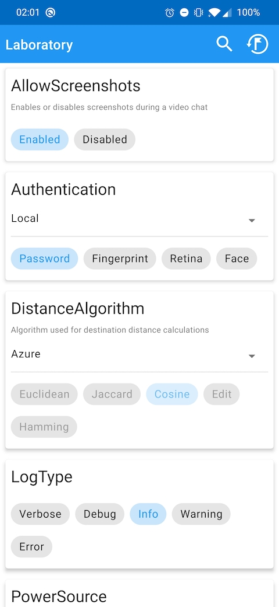

# QA module

It is very often desirable to have an option of configuring feature flag options at runtime. Laboratory addresses this problem with its QA modules.

## Inspector

Feature flags inspection is available through the `laboratory-inspector` artifact. `LaboratoryActivity` is an [Activity](https://developer.android.com/reference/android/app/Activity) that enables inspection and modifications of feature flags.

{: style="width:480px" .center }

Inspector displays feature flags as cards and their options on chips. Active options of feature flags are marked with a highlight colour. A local option of a feature flag can be changed by tapping on a chip. Chips that do not use `Local` sources cannot have their options changed. If a feature flag has multiple sources available they can be switched from a drop down menu.

Feature flags (including sources) can be reset to their default options with a button in an action bar.

## Configuration

Before `LaboratoryActivity` can be started it has to be configured with an instance of `Laboratory` and at least one instance of `FeatureFactory`. `FeatureFactory` is an interface that should gather feature flags that are logically grouped together. Logical grouping can be different for each application but in most cases all feature flags in the project belong to a single unit. Cases when you might want to split feature flags are, for example:

- Feature flags that do not belong to your project and are exposed to you from an external library.
- Abundance of feature flags and a need to increase readability of the inspector interface by separating feature flags into custom categories.

!!! tip
    A lot of the boilerplate code presented here can be generated with the [Gradle plugin](gradle-plugin.md). It is highly recommended to rely on the plugin instead of hand writing the code.

```kotlin
val sourcedFeatureStorage = FeatureStorage.sourced(
  localSource = FeatureStorage.inMemory(),
  remoteSources = mapOf(
    "Firebase" to FeatureStorage.inMemory(),
    "Aws" to FeatureStorage.inMemory(),
    "Azure" to FeatureStorage.inMemory(),
  ),
)
val laboratory = Laboratory.create(sourcedFeatureStorage)

LaboratoryActivity.configure(
  laboratory = laboratory,
  featureFactory = CustomFeatureFactory,
)
LaboratoryActivity.start(context)

object CustomFeatureFactory : FeatureFactory {
  @Suppress("UNCHECKED_CAST")
  public override fun create() = setOf(
    AllowScreenshots::class.java,
    Authentication::class.java,
    PowerSource::class.java,
    DistanceAlgorithm::class.java,
    LogType::class.java,
  ) as Set<Class<Feature<*>>>
}

enum class AllowScreenshots : Feature<AllowScreenshots> {
  Enabled,
  Disabled;

  public override val defaultOption get() = Disabled

  override val description: String = "Enables or disables screenshots during a video chat"
}

enum class Authentication : Feature<Authentication> {
  Password,
  Fingerprint,
  Retina,
  Face;

  public override val defaultOption get() = Password

  @Suppress("UNCHECKED_CAST")
  override val source: Class<Feature<*>> = Source::class.java as Class<Feature<*>>

  enum class Source : Feature<Source> {
    Local,
    Firebase,
    Aws;

    public override val defaultOption get() = Local
  }
}

enum class DistanceAlgorithm : Feature<DistanceAlgorithm> {
  Euclidean,
  Jaccard,
  Cosine,
  Edit,
  Hamming;

  public override val defaultOption get() = Euclidean

  @Suppress("UNCHECKED_CAST")
  override val source: Class<Feature<*>> = Source::class.java as Class<Feature<*>>

  override val description: String = "Algorithm used for destination distance calculations"

  enum class Source : Feature<Source> {
    Local,
    Firebase,
    Azure;

    public override val defaultOption get() = Azure
  }
}

enum class LogType : Feature<LogType> {
  Verbose,
  Debug,
  Info,
  Warning,
  Error;

  public override val defaultOption get() = Info
}

enum class PowerSource : Feature<PowerSource> {
  Coal,
  Wind,
  Solar,
  Nuclear,
  ColdFusion;

  public override val defaultOption get() = Solar

  @Suppress("UNCHECKED_CAST")
  override val source: Class<Feature<*>> = Source::class.java as Class<Feature<*>>

  enum class Source : Feature<Source> {
    Local,
    Firebase;

    public override val defaultOption get() = Firebase
  }
}
```

## Hyperion

If you use [Hyperion](https://github.com/willowtreeapps/Hyperion-Android) you can easily integrate Laboratory by adding the `laboratory-hyperion-plugin` artifact to your dependencies. This will put an item in Hyperion's debug menu.

{: style="width:480px" .center }

If you'd like to position the Laboratory menu item in a different place on the menu you can override the string id resource.

```xml
<?xml version="1.0" encoding="utf-8"?>
<resources>
  <string name="io_mehow_laboratory_plugin_id" translatable="false">!Laboratory</string>
</resources>

```
